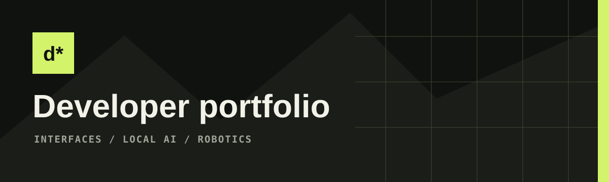

<div align="center">
  
</div>

# Dwij Kansagara: developer portfolio


A React 19 + TypeScript portfolio built with Vite and Framer Motion. It presents Dwij's documented projects, repository links, contact details, and an optional on-device assistant.

## Run

```sh
npm ci
npm run dev
```

Vite prints the local preview address. For a production build:

```sh
npm run build
npm run preview
```

The production site is published at `https://dwij-portfolio.antideploy.com`. Deploy the generated `dist/` directory at the domain root; the canonical metadata uses that production address.

## Visual direction

The creative concept is **curiosity made tangible**: a quiet editorial canvas interrupted by expressive typography, a moving mathematical sculpture, and a bold chartreuse chapter.

| Token          | Dark      | Light     |
| -------------- | --------- | --------- |
| Background     | `#10120f` | `#f2f2e9` |
| Surface        | `#1a1d18` | `#e7e9df` |
| Primary text   | `#eeefe7` | `#20261b` |
| Secondary text | `#a2a69a` | `#5c6654` |
| Accent         | `#d3f36b` | `#456522` |

System sans-serif fonts provide the interface structure, Georgia supplies editorial headlines, and the system monospace stack labels technical details. The page makes no font request to a third party. CSS variables in `src/index.css` own the visual system; `src/App.css` defines component layouts and responsive treatments.

## Page architecture

1. Identity and interactive particle hero, with a direct route to selected work.
2. Filterable project bento: one featured piece and two supporting experiments.
3. A contrasting about chapter connecting the work to the person.
4. Skills grouped by purpose: interface, intelligence, and connected systems.
5. Interactive terminal with real portfolio answers and theme control.
6. A learning timeline without fabricated employers, dates, or metrics.
7. Static project links to the public source repositories, with no automatic GitHub API request.
8. Contact, clipboard action, email-draft composer, and verified existing social links.
9. An aggregate view counter and a 20-step appreciation meter that remembers progress with a random, site-specific browser value only after interaction.

Privacy, terms, cookie, and refund pages describe the site's actual behavior. The contact composer requires explicit consent before it prepares an email draft. The shared counter source lives in `services/engagement/`.

## Motion and interaction

Framer Motion handles viewport reveals, filter layout transitions, and spring-smoothed reading progress. CSS handles smaller hover and project-art effects. A Canvas 2D toroidal particle field reacts to the pointer at a capped frame rate, skips drawing outside the viewport or in a background tab, and caps pixel density. It requires no 3D dependency or downloaded image assets.

Operating-system reduced-motion preferences disable moving transforms and stop ambient animation. A visible pause control stops the sculpture and CSS ambient animations. The browser cursor stays intact. Theme preference persists locally when storage is available.

- **Ctrl/Cmd + K:** native modal command menu. Tab navigates; Enter selects; Escape closes.
- **Terminal:** `help`, `about`, `projects`, `skills`, `contact`, `theme`, `clear`, `hello`, `whoami`. Input is interpreted locally, never executed as code. History is bounded and stays in memory.
- **Project filters:** update the visible cards and accessible pressed states.
- **Contact:** copies the real email or opens a prefilled mail draft after required form consent. Nothing is submitted by the website or stored by the application.
- **AI assistant:** existing opt-in WebLLM implementation retained. See `AI-ASSISTANT.md` for supported hardware, download sizes, and privacy behavior.

## Content and implementation map

- `src/portfolio.ts`: project descriptions, source URLs, and skills.
- `src/assistantKnowledge.ts`: grounded assistant answers and context.
- `src/App.tsx`: page composition, navigation, terminal, filters, contact, and repository links.
- `src/ParticleSculpture.tsx`: procedural, responsive hero sculpture.
- `src/ProjectVisual.tsx`: project-specific art components.
- `src/PortfolioAssistant.tsx`: existing optional local AI experience.
- `public/privacy`, `public/terms`, `public/cookies`, and `public/refunds`: legal and data-use disclosures.

The main page uses the existing Vite/React architecture instead of introducing an unnecessary server. WebLLM remains dynamically imported only after explicit enablement; its large optional runtime is separate from the main page bundle. No API key or paid service is required.

## Validation

```sh
npm run build
npm test
npm run lint
```

Browser QA covers desktop and mobile rendering, filters, terminal commands, command-menu open/close behavior, both themes, mobile navigation, reduced motion, and horizontal overflow at 320, 375, 390, 540, 768, 1024, and 1440 pixels. The optional model's actual inference still requires supported WebGPU hardware and an explicit model download.

## Research references

- https://brittanychiang.com/: clear project and experience hierarchy.
- https://www.joshwcomeau.com/: playful, purposeful interaction and motion.
- https://linear.app/: restrained product presentation and surface hierarchy.
- https://motion.dev/docs/react-accessibility: reduced-motion implementation.
- https://vite.dev/guide/static-deploy.html: production static-build workflow.


